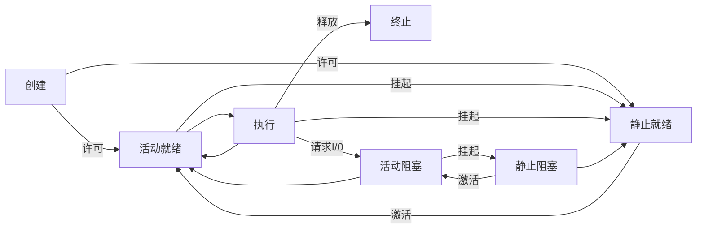

# 操作系统调度笔记

引入挂起的进程转换图：

## 进程调度算法

### 先来先服务 （FCFS）

如果早就绪的进程排在就绪队列的前面，迟就绪的进程排在就绪队列的后面，那么先来先服务`(FCFS: first come first service)`总是把当前处于就绪队列之首的那个进程调度到运行状态。也就说，它只考虑进程进入就绪队列的先后，而不考虑它的下一个CPU周期的长短及其他因素。FCFS算法简单易行，是一种非抢占式策略，但性能却不大好。

先来先服务的调度算法：最简单的调度算法，既可以用于作业调度 ，也可以用于程序调度，当作业调度中采用该算法时，系统将按照作业到达的先后次序来进行调度，优先从后备队列中，选择一个或多个位于队列头部的作业，把他们调入内存，分配所需资源、创建进程，然后放入“就绪队列”,直到该进程运行到完成或发生某事件堵塞后，进程调度程序才将处理机分配给其他进程。

### 时间片轮转 （RR）

在早期的时间片轮转法中，系统将所有的就绪进程按先来先服务的原则，排成一个队列，每次调度时，把CPU分配给队首进程，并令其执行一个时间片。时间片的大小从几ms到几百ms。当执行的时间片用完时，由一个计时器发出时钟中断请求，调度程序便据此信号来停止该进程的执行，并将它送往就绪队列的末尾;然后，再把处理机分配给就绪队列中新的队首进程，同时也让它执行一个时间片。这样就可以保证就绪队列中的所有进程，在一给定的时间内，均能获得一时间片的处理机执行时间。

如果在时间片结束时进程还在运行，则CPU将被剥夺并分配给另一个进程。如果进程在时间片结束前阻塞或结束，则CPU当即进行切换。调度程序所要做的就是维护一张就绪进程列表，当进程用完它的时间片后，它被移到队列的末尾。

### 高响应比优先 （HRRN）

高响应比优先调度算法`（Highest Response Ratio Next）`是一种对CPU中央控制器响应比的分配的一种算法。HRRN是介于FCFS（先来先服务算法）与SJF（短作业优先算法）之间的折中算法，既考虑作业等待时间又考虑作业运行时间，既照顾短作业又不使长作业等待时间过长，改进了调度性能。

短作业优先调度算法 + 动态优先权机制
既考虑作业的执行时间也考虑作业的等待时间，综合了先来先服务和最短作业优先两种算法的特点。

高响应比优先调度算法既考虑作业的执行时间也考虑作业的等待时间，综合了先来先服务和最短作业优先两种算法的特点。
该算法中的响应比是指作业等待时间与运行比值，响应比公式定义如下：
响应比 =（等待时间+要求服务时间）/ 要求服务时间,即RR=（w+s）/s=1+w/s，因此响应比一定是大于等于1的。

### 优先级调度算法 (SJF)

SJF 算法是通用优先级调度算法的一个特例。每个进程都有一个优先级与其关联，而具有最高优先级的进程会分配到 CPU。具有相同优先级的进程按 FCFS 顺序调度。SJF 算法是一个简单的优先级算法，其优先级（p）为下次（预测的）CPU 执行的倒数。CPU 执行越长，则优先级越小；反之亦然。

优先调度可以是抢占的或非抢占的。当一个进程到达就绪队列时，比较它的优先级与当前运行进程的优先级。如果新到达进程的优先级高于当前运行进程的优先级，那么抢占优先级调度算法就会抢占 CPU。非抢占优先级调度算法只是将新的进程加到就绪队列的头部。

### 多级反馈队列调度算法 (MFQ)

多级反馈队列调度算法既能使高优先级的作业得到响应又能使短作业（进程）迅速完成。（对比一下FCFS与高响应比优先调度算法的缺陷）。

多级反馈队列调度算法是一种CPU处理机调度算法，UNIX操作系统采取的便是这种调度算法。 [1] 
多级(假设为N级)反馈队列调度算法可以如下原理：

1、设有N个队列（Q1,Q2....QN），其中各个队列对于处理机的优先级是不一样的，也就是说位于各个队列中的作业(进程)的优先级也是不一样的。一般来说，优先级Priority(Q1) > Priority(Q2) > ... > Priority(QN)。怎么讲，位于Q1中的任何一个作业(进程)都要比Q2中的任何一个作业(进程)相对于CPU的优先级要高（也就是说，Q1中的作业一定要比Q2中的作业先被处理机调度），依次类推其它的队列。

2、对于优先级最低的队列来说，里面是遵循时间片轮转法。也就是说，位于队列QN中有M个作业，它们的运行时间是通过QN这个队列所设定的时间片来确定的；对于其他队列，遵循的是先来先服务算法，每一进程分配一定的时间片，若时间片运行完时进程未结束，则进入下一优先级队列的末尾。

3、各个队列的时间片是一样的吗？不一样，这就是该算法设计的精妙之处。各个队列的时间片是随着优先级的增加而减少的，也就是说，优先级越高的队列中它的时间片就越短。同时，为了便于那些超大作业的完成，最后一个队列QN(优先级最低的队列)的时间片一般很大(不需要考虑这个问题)。