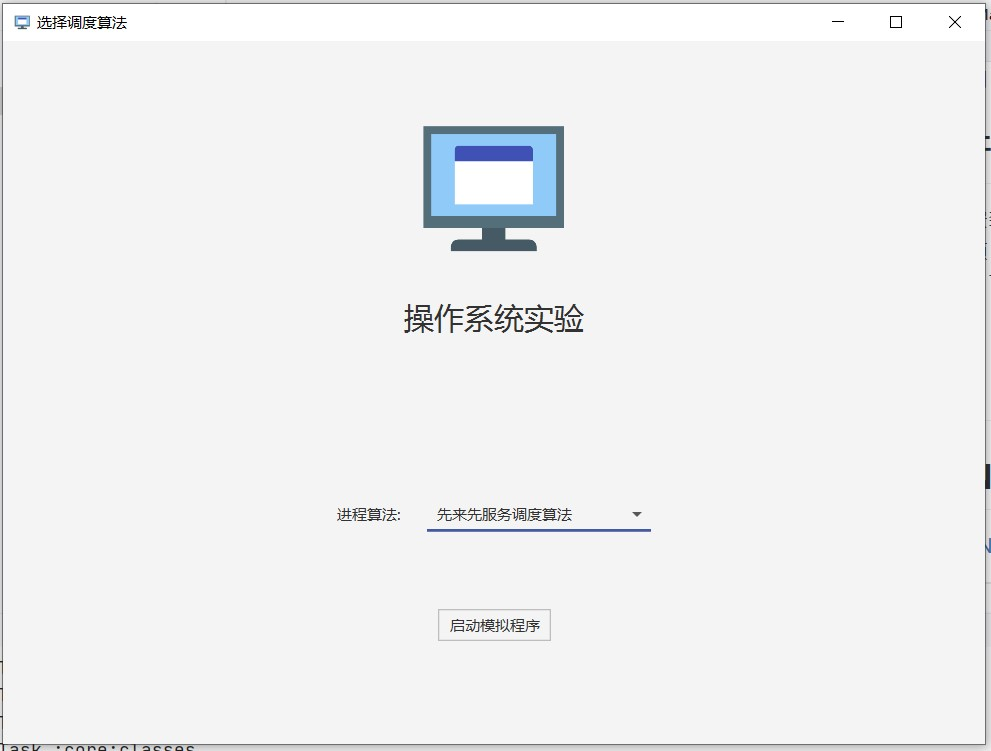
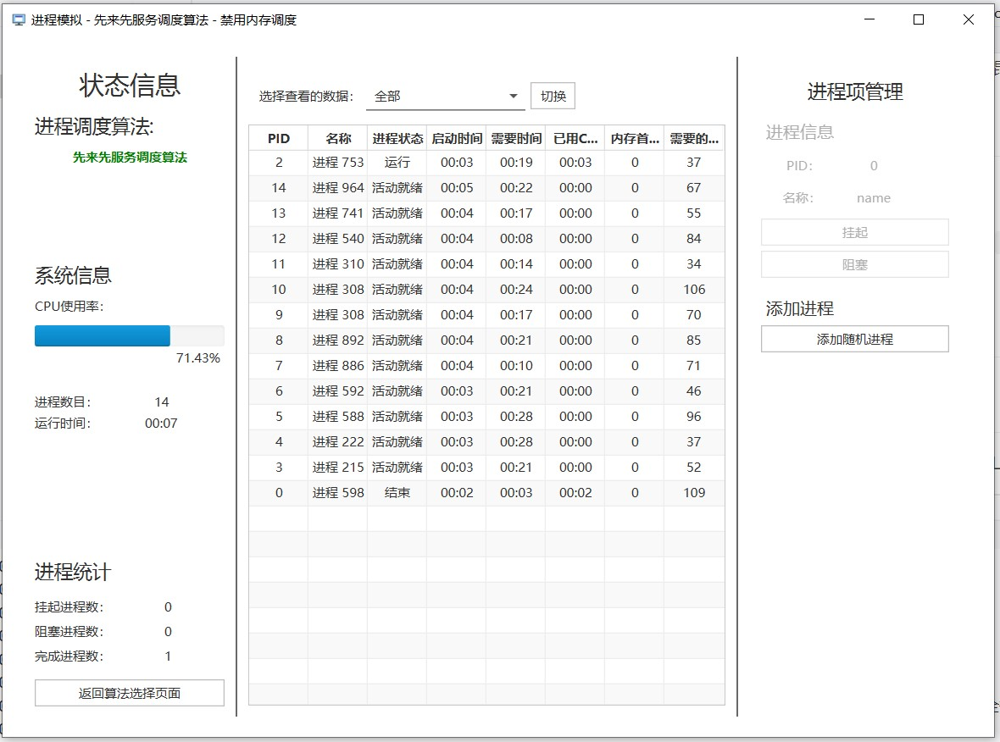
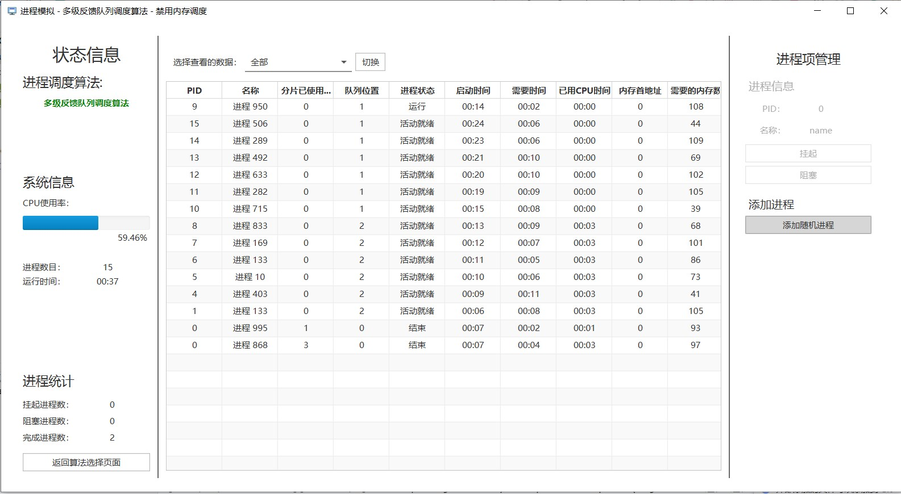

# 操作系统实验 (实验 1)

> 操作系统实验作业 (实验 1)

此实例的最新代码可在 [Github](https://github.com/ExplodingFKL/SystemOperation/tree/unit1) 分支下找到 .

## 关于此项目

此项目使用 `Kotlin` + `Java FX` 混合开发

## 快速开始
 
 1. 下载安装 Java JDK 11 
 2. 克隆项目
 3. 在项目下打开控制台，执行 `./gradlew run` 即可启动项目

## 截图

## LICENSE

请看 [LICENSE](./LICENSE) 来了解此项目的 LICENSE
